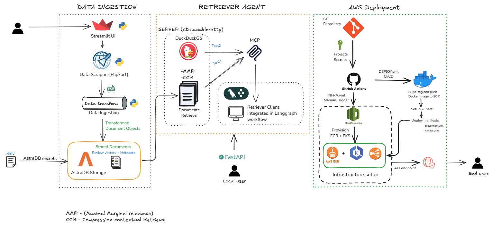
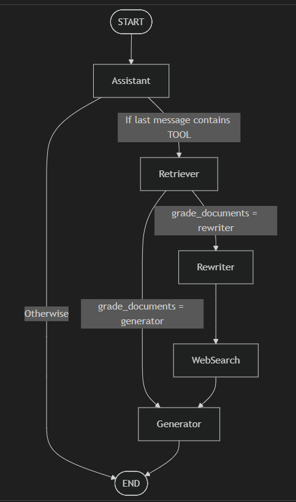

# 🛍️ Ecommerce-Product-Assistant

An AI-powered e-commerce assistant that answers product questions using **Retrieval-Augmented Generation (RAG)**, **LangGraph agent workflows**, and a **tool-based retriever system** deployed on cloud infrastructure.

The assistant can intelligently search product data, rewrite queries, perform web search when needed, and generate grounded responses.

---

## 🧩 Overall System Architecture



The system is composed of **three major layers**:

### 1️⃣ Data Ingestion Layer
Responsible for collecting and preparing product data.

- Product scraping (e.g., Flipkart)
- Data transformation pipelines
- Document object creation
- Storage in vector + metadata store
- AstraDB used as document storage backend

---

### 2️⃣ Retriever Agent Layer

This is the intelligence core.

| Component | Responsibility |
|-----------|----------------|
| **FastAPI Server** | Serves user queries |
| **Retriever** | Fetches relevant documents |
| **MCP Tool Server** | Provides external tools |
| **MMR** | Improves document diversity |
| **CCR** | Compression contextual retrieval |
| **LangGraph Workflow** | Orchestrates reasoning flow |

This layer ensures the assistant does not hallucinate and always grounds responses in data.

---

### 3️⃣ AWS Deployment Layer

Production deployment pipeline:

- GitHub repo → GitHub Actions CI/CD
- Docker image build & push to ECR
- Infrastructure provisioned via CloudFormation
- Deployment on Kubernetes (EKS)
- API exposed to end users

---

## 🔁 LangGraph Agent Workflow



The assistant dynamically decides how to respond:

START → Assistant → Tool decision → Retriever → (Generator OR Rewriter → WebSearch → Generator) → END

This allows adaptive reasoning instead of static RAG.

---

## 🚀 Features

- 🔍 Product-aware search  
- 🧠 LLM reasoning with document grounding  
- 🔁 Query rewriting for improved retrieval  
- 🌐 Web search fallback  
- 📊 Evaluation pipeline  
- 🛠 Tool server (MCP) integration  
- 🐳 Docker-ready  
- ☁️ Cloud deployable  

---

## 🏗️ Project Structure

```
Ecommerce-Product-Assistant/
│
├── architecture/
│   ├── architecture.png
│   └── flow.png
│
├── prod_assistant/
│   ├── workflow/
│   ├── retriever/
│   ├── mcp_server/
│   ├── prompt_library/
│   ├── etl/
│   ├── evaluation/
│   ├── router/
│   ├── config/
│   ├── logger/
│   ├── utils/
│   └── exception/
│
├── infra/
├── k8/
├── data/
├── logs/
├── test/
└── Dockerfile
```

---

## ⚙️ Setup

```bash
git clone https://github.com/your-username/Ecommerce-Product-Assistant.git
cd Ecommerce-Product-Assistant
pip install -r requirements.txt
```

---

## 🔐 Environment Variables

```
GROQ_API_KEY=
GOOGLE_API_KEY=
ASTRA_DB_KEYSPACE=
TAVILY_API_KEY=
OPENAI_API_KEY=
ASTRA_DB_APPLICATION_TOKEN=
ASTRA_DB_API_ENDPOINT=


```

---

## ▶️ Run Locally

```bash
uvicorn prod_assistant.router.main:app --host 0.0.0.0 --port 8001
```

---

## 🐳 Docker

```bash
docker build -t ecommerce-product-assistant .
docker run -p 8001:8001 ecommerce-product-assistant
```

---

## 📊 Evaluation

Located in:

```
prod_assistant/evaluation/
```

Used to measure answer quality and retrieval grounding.

---

## 🔮 Future Work

- Conversational memory  
- Product ranking model  
- Integration into full fledge system 
- Feedback learning  

---

## 📜 License

MIT License
